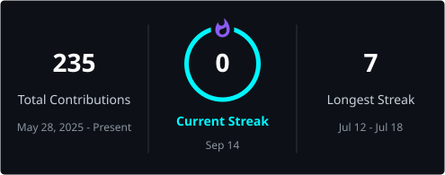

# 👾 VEDANT SINGH

<div align="center">


<br/>


### `> whoami`

**Computer Science Engineering Student • Full Stack Java Developer • Problem Solver**

<br/>

<a href="https://github.com/Singh-Vedant">

</a>

 

<a href="https://github.com/Singh-Vedant?tab=repositories">

</a>

 


</div>

<br/>

---

## `01` // ABOUT_ME

```text
┌──────────────────────────────────────────────────────────────┐
│                                                              │
│  👨‍💻  Full Stack Java Developer                            │
│                                                              │
│  🎓  Computer Science Engineering Student                   │
│                                                              │
│  ⚡  Building scalable and modern web applications          │
│                                                              │
│  ☕  Java + Spring Boot enthusiast                          │
│                                                              │
│  🌐  React + Tailwind CSS                                   │
│                                                              │
│  🗄️  MySQL + PostgreSQL + MongoDB                           │
│                                                              │
│  🧠  Currently strengthening DSA & problem solving          │
│                                                              │
└──────────────────────────────────────────────────────────────┘
```

> **I build, break, learn, and build again.**

I'm passionate about creating **real-world software**, understanding how systems work behind the scenes, and continuously improving my development skills.

---

## `02` // TECH_STACK

### `LANGUAGES`

<p align="left">

</p>

### `BACKEND`

<p align="left">

</p>

### `FRONTEND`

<p align="left">

</p>

### `DATABASE`

<p align="left">

</p>

### `TOOLS`

<p align="left">

</p>

---

# `03` // GITHUB_ANALYTICS

<div align="center">




</div>

# `04` // CONTRIBUTION_STREAK

<div align="center">



</div>

# `05` // CONTRIBUTION_MATRIX

<div align="center">


</div>

The activity graph uses the project's current canonical Vercel deployment rather than the discontinued Heroku/Cyclic deployments.

---
# `06` // GITHUB_TROPHIES

<div align="center">



</div>

# `07` // FEATURED_PROJECTS

<div align="center">

<table>
<tr>

<td width="50%" valign="top">

### 📦 SHIPTRACK PRO

**Logistics Management Platform**

A modern logistics platform focused on shipment management, tracking, addresses and administrative operations.

**STACK**

`React` `Tailwind CSS`
`Spring Boot` `PostgreSQL`

<br/>

<a href="https://github.com/Singh-Vedant/ShipTrack-Pro">


</a>

</td>

<td width="50%" valign="top">

### 🧠 DEEPFAKE DETECTION

**AI / ML Project**

A project exploring detection of manipulated media using Machine Learning and Generative AI techniques.

**STACK**

`Java` `Spring Boot`
`React` `Machine Learning`

<br/>

<a href="https://github.com/Singh-Vedant">


</a>

</td>

</tr>
</table>

</div>

---

# `08` // CURRENTLY_BUILDING

```text
╭────────────────────────────────────────────────────────────╮
│                                                            │
│  > LEARNING                                                │
│                                                            │
│    ├── Advanced Java                                       │
│    ├── Spring Boot                                         │
│    ├── REST APIs                                           │
│    ├── Hibernate / JPA                                     │
│    ├── System Design                                       │
│    └── Data Structures & Algorithms                        │
│                                                            │
│  > BUILDING                                                │
│                                                            │
│    ├── Full Stack Applications                             │
│    ├── Backend Services                                    │
│    └── Database-driven Systems                             │
│                                                            │
╰────────────────────────────────────────────────────────────╯
```

---

# `09` // PROBLEM_SOLVING

<div align="center">

### `DATA STRUCTURES × ALGORITHMS`

`ARRAYS` • `STRINGS` • `HASHING` • `TWO POINTERS`

`SLIDING WINDOW` • `STACK` • `QUEUE` • `LINKED LIST`

`BINARY SEARCH` • `TREES` • `GRAPHS` • `DYNAMIC PROGRAMMING`

</div>

---

# `10` // DEVELOPMENT_PHILOSOPHY

<div align="center">

```text
        THINK
          ↓
       DESIGN
          ↓
        CODE
          ↓
        TEST
          ↓
       IMPROVE
          ↓
        REPEAT
```

### `Clean Code > Clever Code`

### `Consistency > Motivation`

### `BUILD > WATCH`

</div>

---

# `11` // CONNECT

<div align="center">

<a href="https://github.com/Singh-Vedant">

</a>

 

<a href="YOUR_LINKEDIN_URL">

</a>

 

<a href="YOUR_PORTFOLIO_URL">

</a>

 

<a href="mailto:YOUR_EMAIL@gmail.com">

</a>

</div>

---

# `12` // RESUME

<div align="center">

<a href="YOUR_RESUME_URL">


</a>

</div>

<br/>

---

<div align="center">


### `// SYSTEM STATUS: ONLINE`

**Thanks for visiting my profile.**

`[ BUILD • LEARN • SHIP • REPEAT ]`

</div>
